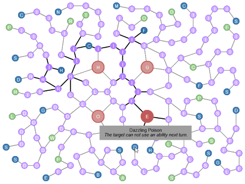

# Talents tree & spells

The talents tree is where you can customize your characters. Each character can allocate 30 points in this tree, excluding the starting position. You cannot allocate a point if you have not unlocked an adjacent point.

* The starting position (in red) depends on your character race. Each race has a different starting position.

* The active skills (in blue) are spells you can cast during the fight.

* The passive skills (in green) do not have to be cast, they are permanently activated during the fight.

* The statistics (in purple) increase the specified characteristic. Check the [character page](teams.md) for more information.

*No matter your starting race, you are able to reach every single node.*

----

## Woodoo

The Woodoo is a magical class designed to inflict malediction on its opponents while locating invisible entities.

This is one of the two Human branches and it is located next to Goblin race.

You can find this class on the top-left part of the tree.

### Nightmare *(active)*

Nightmare applies a debuff on the target, who will lose some HP each time he moves.

The debuff lasts for 3 turns and deals 1 magical damage per movement.

* Range: 1 - 5
* Area of effect: 1 cell
* Cooldown: 3 turns
* Line of sight?: Yes

### Clairvoyance *(active)*

Clairvoyance dispells the invisibility of all opponents in the area.

* Range: 0 - 5
* Area of effect: 5 cells (circle)
* Cooldown: 1 turn
* Line of sight?: Yes

### Malediction *(active)*

Malediction applies a debuff on the target, inflicting damage each turn.

The debuff lasts for 3 turns and inflicts 1 magical damage per turn.

* Range: 1 - 3
* Area of effect: 1 cell
* Cooldown: 2 turns
* Line of sight?: Yes

### Trance *(passive)*

Trance increases the duration of all debuffs inflicted by this character by 1 turn.

Also decreases the duration of all debuffs cast on this character by 1 turn.

&nbsp;

### Revelation *(passive)*

Revelation allows the character to see invisible entities within an area of 2 cells around them.

This passive skill does not require line of sight.

&nbsp;

----

## Mage

### Fireball *(active)*

### Meteore *(active)*

### Cold feet *(active)*

### Offensive Senses *(passive)*

### Damage Zone *(passive)*

&nbsp;

----

## Trapper

### Fire Trap *(active)*

### Snare Trap *(active)*

### Stun Trap *(passive)*

### Careful *(passive)*

### Far Sight *(passive)*

&nbsp;

----

## Archer

### Snipe *(active)*

### Dazzle *(active)*

### Ghost Arrow *(active)*

### Poison *(passive)*

### Sniper *(passive)*

&nbsp;

----

## Rogue

### Shadow walk *(active)*

### Heavy poison *(active)*

### Dazzling poison *(active)*

### Sneaky *(passive)*

### Lucky foot *(passive)*

&nbsp;

----

## Warrior

The Warrior is a physical class designed to deal physical damages ignoring a part of the target defences.

This is one of the two Orc branches and is located next to Elf race.

You can find this class on the bottom part of the tree.

### Smash *(active)*

Smash makes the user hit the ground in front of him, dealing [2 x strength] physical damages to all entities in a line.

* Range: 1 - 1
* Area of effect: 2 cells
* Cooldown: 2 turns
* Line of sight?: Yes

### Bladestorm *(active)*

Bladestorm creates a storm of blades around the user, dealing [1 x strength] physical damages to all nearby entities.

* Range: -
* Area of effect: 2 cells
* Cooldown: 1 turns
* Line of sight?: Yes

### Enhanced Sword *(active)*

Enhanced Sword will make your next physical attack ignore the physical and magical defences of the targets.

The attack also deals an additional [strength x intelligence x 0.05] physical damages.

&nbsp;

### Penetration *(passive)*

Penetration makes your physical attacks ignore 20% of the target physical defence.

&nbsp;

### Avenger *(passive)*

Avenger increases the physical damages dealt based on the bearer missing health.

Each physical attack deals an additional [strength x (1 - curHP / totHP)] physical damages.

&nbsp;

----

## Tank

The Tank is a physical class designed to protect allies and reduce physical damage received.

This is one of the two Orc branches and is located next to Human race.

You can find this class on the bottom-left part of the tree.

### Shield Break *(active)*

Shield Break pushes back by 2 cells up to 4 entities around the caster.

If a wall stands in the way, the entities are not moved past the wall and stop.

* Range: 0
* Area of effect: 1 cell
* Cooldown: 2 turns
* Line of sight?: Yes

### Shield Bump *(active)*

Shield Bump is a close combat talent that deals [1 x strength] physical damages to the target.

* Range: 1
* Area of effect: 1 cell
* Cooldown: 1 turns
* Line of sight?: Yes

### Great Wall *(active)*

Great Wall makes the caster take a defensive stance, increasing its defence by [1.5 x strength] at the cost of 2 movement points for the entire duration.

Great Wall last 2 turns.

* Range: 0
* Area of effect: 1 cell
* Cooldown: 3 turns
* Line of sight?: Yes

### Last man standing *(passive)*

Last man standing multiplies the defence of the bearer by 1.5 when its current hit points are less than 30% of its total hit points.

&nbsp;

### Way of the shield *(passive)*

Way of the shield halves the physical damages dealt and the physical damages received.

This passive reduces the bearer movement points by 1.

&nbsp;

----

## Priest

The Priest is a magical class designed to heal allies and protect them.

This is one of the two Human branches and is located next to Orc race.

You can find this class on the left part of the tree.

### Holy Hand *(active)*

Holy Hand use holy power to heal the target for [0.7 x intelligence] life.

* Range: 0 - 3
* Area of effect: 1 cell
* Cooldown: 1 turns
* Line of sight?: No

### Divine Protection *(active)*

Divine Protection applies a shield on all the entities in a zone around the priest, be it allies or enemies.

The shield can absorb a total [0.8 x intelligence] damages and last 2 turns.

* Range: 0
* Area of effect: 3 cell
* Cooldown: 3 turns
* Line of sight?: Yes

### Shieldify *(active)*

Shieldify slightly increases the armor of an ally by [0.2 x intelligence] for 1 turn.

* Range: 0 - 3
* Area of effect: 1 cell
* Cooldown: 3 turns
* Line of sight?: Yes

### Phoenix *(passive)*

Phoenix allows the bearer to revive once a game with 10% of its maximum HP.

&nbsp;

### Holy Well *(passive)*

Holy Well heals nearby allies for [0.2 x intelligence] at the start of each turn. The bearer is not affected.

This passive does not require line of sight.

* Area of effect: 1 - 4