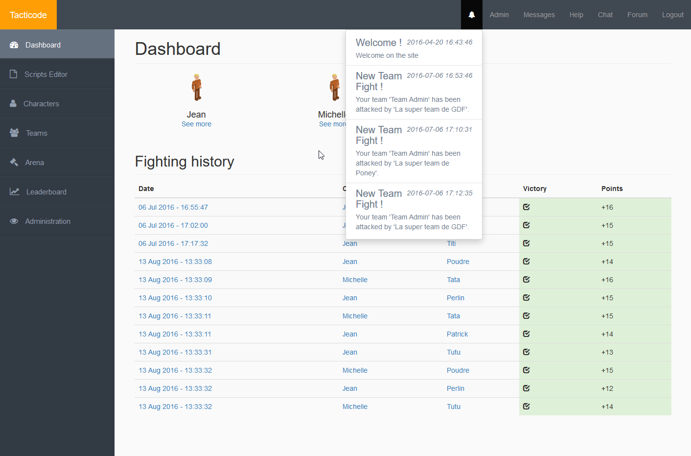
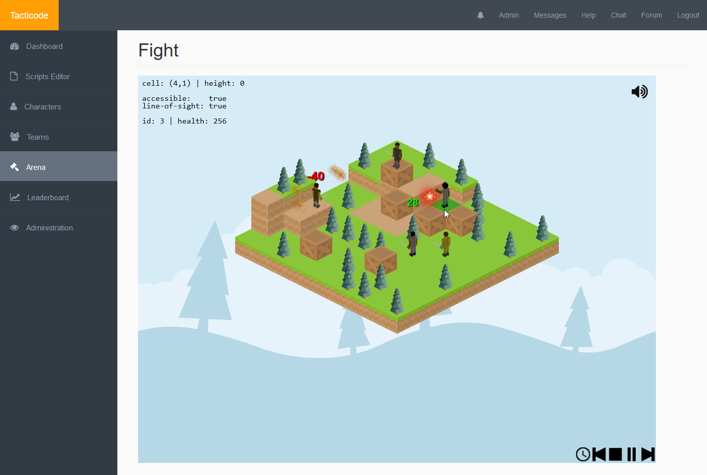
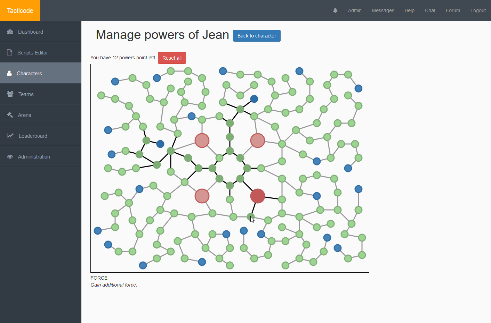

# Tacticode

A video-game made by developers, for developers. [https://tacticode.net/](https://tacticode.net/)

-----

## Introduction

Tacticode is a game where you control a team of five characters. The objective is to defeat the opponent's team by killing their own five characters.

You can customize your characters by choosing from a large range of skills, passive and active. You could have a balanced team, composed of two rangers, two healers and maybe a rogue, or just decide to rush in with five heavy warriors. 

However, there is a trick: the behaviour of each character has to be scripted in JavaScript, you cannot manually control them. The winner is the one with the best AI and the best team composition. There is no randomness in the calculations.

## Gameplay

* [Teams & characters](game/teams.md): If you want more information about teams and characters attributes.

* [Talents tree & spells](game/talents.md): Looking for an exhaustive list of all available skills?

* [Arena & rankings](game/arena.md): Everything you need to know about the arena and the ELO ranking.

* [Scripting - Getting started](scripting/getting-started.md): Want to know how to create your first AI script?

## Screenshots

*The dashboard, where you can see your characters and your fight history.*

*The arena, where you will watch your characters fight against the opponent team.*

*The talent tree, where you can customize your characters with endless possibilities.*
